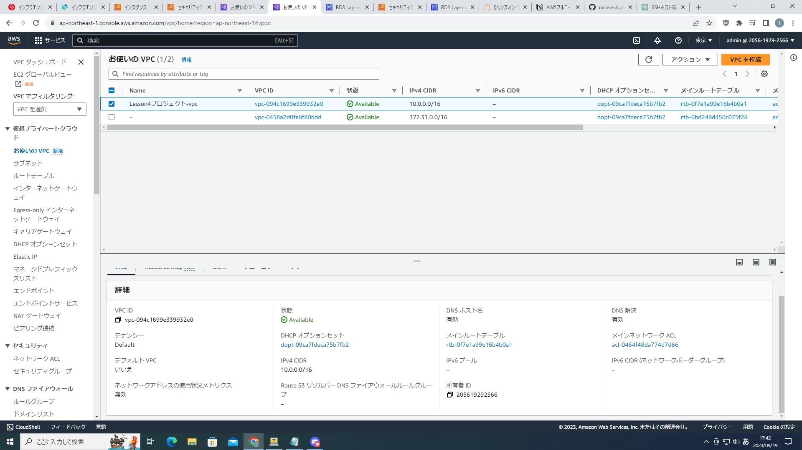
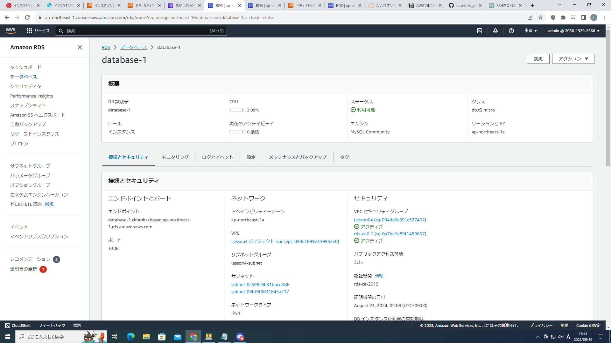
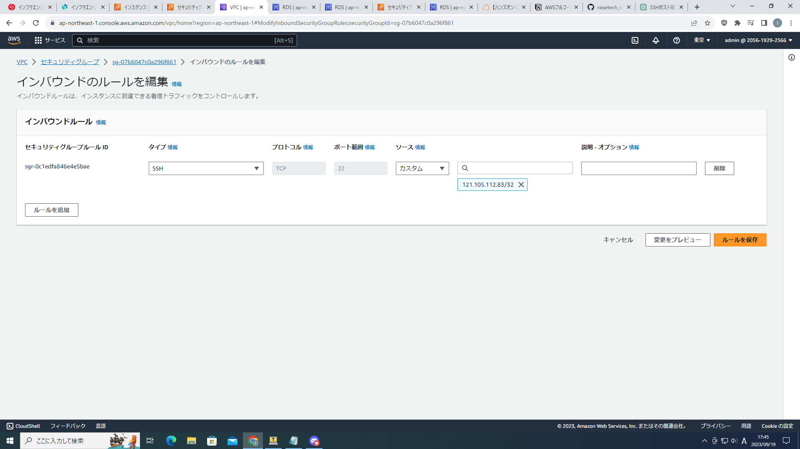

# 第四回課題
1. 新規vpc  
 
2. 新規EC2  
  
3. 新規RDS  
   
4. EC2からRDSへの接続確認  
  
5. EC2のセキュリティグループ  
  
このインスタンスに接続できるのは、自分のipだけにした。(セキュリティ的観点から)　
6. RDSのセキュリティグループ  
  
RDSインスタンスに接続できるのは、5で設定したwebサーバーだけにした。(セキュリティ的観点から) 
